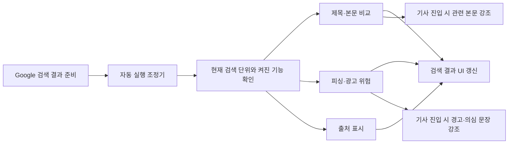

# 구라제거기 — AI Builder Sprint

구라제거기는 Google 검색 결과를 열기 전에 제목과 본문의 일치 여부, 광고·피싱 위험, 출처의 공식성을 한 화면에서 확인하도록 돕는 Chrome 확장 프로그램입니다. 검색 결과만 보고 판단하기 어려운 정보를 실제 페이지 본문과 Upstage Solar 분석 결과로 보완합니다.

## 기능

1. **제목·본문 비교**: 검색 결과 링크의 실제 본문을 읽고 제목을 `본문 일치`, `자극 표현 있음`, `제목과 본문 차이`로 구분합니다. 글에 들어가면 검색어와 관련된 실제 본문 문장을 강조합니다.
2. **피싱·광고 위험**: 본문을 근거로 `피싱 의심`, `광고성`, `로그인 필요`를 판별합니다. 위험 판정 글에 들어가면 경고 배너와 의심 문장을 표시합니다.
3. **공신력 표시**: 검색 대상이 직접 운영하는 공식 사이트와 신뢰할 만한 공신력 출처를 구분해 검색 결과에 표시합니다.

세 기능은 서로 독립적이며 팝업에서 원하는 기능만 켜고 끌 수 있습니다. API 키를 저장한 뒤 Google에서 검색하면 현재 검색 페이지를 자동으로 분석하고, **현재 검색 페이지 분석** 버튼으로 언제든 수동 재분석할 수 있습니다.

## 로컬 설치 및 사용 방법

### 1. 확장 프로그램 설치

1. 저장소를 내려받습니다.

   ```bash
   git clone https://github.com/kook222/AI-Builder-Sprint.git
   cd AI-Builder-Sprint
   ```

2. Chrome 주소창에서 `chrome://extensions`를 엽니다.
3. 우측 상단의 **개발자 모드**를 켭니다.
4. **압축해제된 확장 프로그램을 로드합니다**를 누릅니다.
5. 내려받은 저장소 안의 `unified-extension` 폴더를 선택합니다.
6. 확장 목록에 **구라제거기**가 나타나는지 확인하고 실행합니다.


### 2. Upstage API 키 저장

1. Chrome 툴바에서 **구라제거기** 아이콘을 누릅니다.
2. 팝업 상단의 **Upstage API** 영역에서 `Upstage API 키` 입력란에 `up_...` 형식의 키를 입력합니다.
3. **보기**를 누르면 입력값이 보이고 같은 버튼이 **숨김**으로 바뀝니다. 다시 누르면 키가 가려집니다.
4. **저장**을 누릅니다.
5. 상태가 `미설정`에서 `저장됨`으로 바뀌고 `API 키를 저장했습니다.`가 표시되면 준비가 끝난 것입니다.

키가 없으면 분석을 시작하지 않으며 `먼저 Upstage API 키를 입력해 주세요.`라는 안내가 표시됩니다.

### 3. 사용할 기능 선택

팝업의 **기능 및 진행 상황**에서 세 기능을 각각 선택합니다.

| 팝업 토글 | 검색 결과에서 하는 일 | 링크를 연 뒤 하는 일 |
|---|---|---|
| **제목·본문 비교** | 제목과 실제 본문이 일치하는지 판정하고 필요한 경우 본문 기반 제목을 제안 | 원래 검색어와 관련된 실제 본문 문장을 강조 |
| **피싱·광고 위험** | 피싱·광고·로그인 장벽을 탐지하고 위험 딱지와 근거를 표시 | 위험 판정 글에 경고 배너와 의심 문장 강조 |
| **출처 표시** | 공식 사이트와 공신력 출처를 점으로 표시하고 호버 시 근거 제공 | 기사 내부에는 별도 표시하지 않음 |

- 세 토글은 독립적입니다. 한 개만 켜도 되고 세 개를 모두 켜도 됩니다.
- 기능을 끄면 해당 기능의 진행 작업과 검색 결과 UI만 정리되고 다른 기능은 계속 동작합니다.
- 모든 기능을 끈 채 실행하면 `실행할 기능을 하나 이상 켜 주세요.`가 표시됩니다.
- 꺼진 기능 카드는 `꺼짐`, `—`, `이 기능은 현재 실행되지 않습니다.`로 표시됩니다.

### 4. Google 검색 페이지 자동 분석

1. `google.com` 또는 `google.co.kr`에서 검색합니다.
2. 검색 결과 DOM이 준비되면 켜 둔 기능이 자동으로 시작됩니다. 확장 아이콘을 매번 누를 필요는 없습니다.
3. 현재 페이지에 보이는 일반 검색 결과 전체를 대상으로 분석합니다. 상위 5개만 처리하는 방식이 아닙니다.
4. 팝업을 열면 전체 상태와 기능별 진행 상태, 처리 개수, 진행률, 오류 설명을 확인할 수 있습니다.
5. 검색어를 바꾸거나 Google 검색의 다음 페이지로 이동하면 새 검색 단위로 자동 분석합니다.

검색어(`q`), 페이지 번호(`start`), 검색 종류(`tbm`, `udm`) 조합을 하나의 분석 단위로 사용합니다. 따라서 같은 검색어라도 1페이지와 2페이지, 전체 검색과 뉴스 검색은 서로 다른 페이지로 처리됩니다.

팝업 상태의 의미는 다음과 같습니다.

| 상태 | 의미 |
|---|---|
| `대기` | 실행할 준비가 된 상태 |
| `분석 중` | 하나 이상의 기능이 수집 또는 AI 분석 중인 상태 |
| `일부 실패` | 하나 이상의 기능 또는 결과에서 수집·API 오류가 발생한 상태 |
| `완료` | 켜진 기능의 현재 페이지 처리가 끝난 상태 |

자동 시작이 누락되었거나 일부 결과를 다시 확인하려면 팝업 하단의 **현재 검색 페이지 분석**을 누릅니다. 실행 중에는 버튼 문구가 `현재 페이지 분석 중`으로 바뀌며, 자동 실행과 수동 실행이 겹쳐도 같은 페이지를 중복 호출하지 않습니다. **상태 초기화**는 팝업의 진행 표시를 초기화할 때 사용합니다.

### 5. 검색 결과 판정 읽기

#### 제목·본문 비교

- **본문 일치**: 제목이 본문의 핵심 사실을 대체로 정확하게 반영합니다.
- **자극 표현 있음**: 핵심 사실은 맞지만 과장, 감정적 표현, 낚시성 문구가 포함되어 있습니다.
- **제목과 본문 차이**: 제목이 본문의 주제·사건·수치·결과와 의미 있게 다릅니다. 이 경우 **본문 기반 제목**과 판정 이유를 함께 표시합니다.
- **수집 대기 / 수집 중 / AI 분석 중**: 아직 최종 판정 전인 진행 상태입니다.
- **수집 실패 / AI 분석 실패 / AI 판단 보류**: 해당 결과의 최종 판정을 만들지 못한 상태이며, 일치 또는 불일치를 뜻하지 않습니다.

#### 피싱·광고 위험

- **피싱 의심**: 개인정보, 인증정보, 송금 등을 부당하게 요구하거나 사칭 정황이 있는 결과입니다.
- **광고성**: 상품·서비스 홍보, 제휴 유도, 과도한 구매 전환 목적이 뚜렷한 결과입니다.
- **로그인 필요**: 본문 확인 전에 로그인이나 계정 접근이 필요한 결과입니다.
- 위험 딱지에 마우스를 올리면 **판단 근거**와 확인된 경우 **의심되는 부분**의 원문을 볼 수 있습니다.
- 위험 딱지가 없다는 사실만으로 절대적으로 안전하다는 뜻은 아닙니다. 수집하지 못했거나 근거가 부족한 경우에는 섣불리 위험 딱지를 붙이지 않습니다.

#### 출처 표시

- **파란 점**: 검색 대상 기관·기업·서비스가 직접 운영하는 공식 사이트입니다.
- **초록 점**: 관련 정부·공공기관·대학·학회·국제기구, 공식 파트너·배포 페이지처럼 공신력이 있다고 판정한 출처입니다. 일반 언론이라는 이유만으로 표시하지는 않습니다.
- 점에 마우스를 올리거나 포커스하면 AI의 확신도와 판단 근거를 확인할 수 있습니다. 
- 확신도 70% 이상인 공식·공신력 판정만 표시합니다. 점이 없다고 해서 곧바로 비공식 또는 위험 사이트라는 뜻은 아닙니다.

### 6. 링크를 연 뒤 하이라이트 확인

1. 자동 또는 수동 분석이 끝난 Google 검색 결과의 일반 기사 링크를 엽니다.
2. **제목·본문 비교**가 켜져 있으면 원래 검색어와 관련된 본문 문장을 청록색 계열로 강조합니다.
3. **피싱·광고 위험** 판정이 있으면 상단 경고 배너와 함께 피싱 구절은 진한 적색, 광고 구절은 분홍색 계열로 강조합니다.
4. 제목 기능은 동적으로 늦게 로드되는 기사의 본문을 최대 15초 동안 기다리고, 이후 기사 DOM이 바뀌어도 관련 문장 강조를 다시 적용합니다.
5. 위험 기능은 원격 수집이 막힌 결과를 사용자가 직접 열면 현재 화면에 렌더링된 본문으로 다시 판정해 가능한 경우 경고와 의심 문장을 표시합니다.

하이라이트는 임의의 웹페이지에 직접 들어갔을 때가 아니라 **분석한 Google 검색 결과 → 해당 링크 진입** 흐름에서 동작합니다. 현재 URL, canonical URL, 문서 제목을 이용해 방금 분석한 결과와 열린 글을 연결합니다. 동영상 결과는 검색 결과의 제목 검토는 가능하지만 기사 본문 하이라이트는 제공하지 않습니다.

## 기능 구현 방식



### 공통 실행 구조

- Chrome Manifest V3의 Service Worker와 Content Script로 구성되어 별도 서버 없이 브라우저 안에서 동작합니다.
- 자동 실행 조정기가 최초 로드, Google 내부 URL 변경, 검색 결과 DOM 변경을 감지합니다. 결과가 안정된 뒤 실행해 이전 페이지의 DOM을 잘못 분석하는 문제를 줄였습니다.
- 제목, 위험, 출처 표시 기능은 서로 기다리지 않고 병렬로 실행합니다. 한 기능이나 한 결과가 실패해도 나머지 분석은 계속됩니다.
- 동시에 지나치게 많은 요청을 보내지 않도록 공통 Solar 동시 요청 수를 제한하고, 긴 작업 중에는 Service Worker가 종료되지 않도록 실행 상태를 유지합니다.
- 기능별 진행률은 `chrome.storage.session`, API 키와 토글 설정은 `chrome.storage.local`에 저장합니다.
- Google의 SPA 페이지 이동, 뒤로가기, 앞 페이지 이동을 감지해 이전 실행과 UI를 정리하고 현재 검색 단위의 결과만 표시합니다.

### 통합본 파일 구조

```text
unified-extension/
├── manifest.json                 # 확장 권한, Service Worker, Content Script 등록
├── background.js                 # 세 기능의 시작·중복 방지·진행 상태 조정
├── google-auto-run.js            # Google 검색 단위 감지와 자동 실행
├── popup.html / popup.css / popup.js
│                                  # API 키, 기능별 토글, 진행률, 수동 재분석 UI
├── shared/
│   ├── settings.js               # API 키와 기능 설정
│   ├── progress.js               # 기능별 세션 진행 상태와 안전한 갱신
│   ├── solar-gate.js             # 세 기능이 공유하는 Solar 동시성 제한
│   ├── service-worker-keepalive.js
│   │                              # 긴 분석 중 Service Worker 수명 유지
│   ├── url-safety.js             # 공개 HTTP(S) URL만 허용
│   └── content.css               # 검색 결과 공용 UI 배치 영역
└── features/
    ├── title/                     # 제목 판정, 렌더링 본문 수집, 기사 하이라이트
    ├── risk/                      # 위험 판정, JSON 검증, 경고·의심 구절 강조
    └── official/                  # 공식성 분류, 2차 검증, 출처 표시와 Popover
```

### 제목·본문 비교 구현

1. Google 검색 결과의 제목과 링크를 수집하되 광고, 나무위키, Wikipedia, PDF를 제외합니다.
2. 화면에 보이는 축약문만 판단 근거로 쓰지 않고, 백그라운드의 비활성 탭에서 실제 렌더링된 페이지를 열어 본문을 추출합니다. 수집 탭은 처리 후 자동으로 닫습니다.
3. 긴 본문을 임의로 잘라 버리지 않고 여러 청크로 나누어 Solar로 분석한 뒤 최종 구조화 판정으로 병합합니다.
4. AI가 반환한 본문 기반 제목, 수치, 근거 인용, 하이라이트 문구가 실제 원문에 존재하는지 다시 검증합니다. 원문에서 확인되지 않는 값은 화면에 사용하지 않습니다.
5. 검색 결과와 기사 탭의 URL·canonical URL·제목을 연결해 기사 진입 즉시 임시 하이라이트를 표시하고, 실제 화면 본문 분석이 끝나면 최종 구절로 교체합니다.

### 피싱·광고 위험 구현

1. 검색 결과별로 핵심 본문을 최대 20,000자까지 추출하고, 그중 최대 18,000자를 Solar의 구조화 JSON 판정에 전달해 과도한 지연을 줄입니다.
2. 반환된 라벨과 근거가 실제 입력 본문으로 뒷받침되는지 검증하고, 근거가 없는 위험 라벨은 제거합니다.
3. 위험 판정이 나온 경우 두 번째 분석에서 실제 원문에 존재하는 의심 문장만 추출해 기사 페이지 하이라이트에 사용합니다.
4. 서버가 자동 수집을 차단하거나 본문이 200자 미만이면 즉시 위험 판정을 만들지 않습니다. 사용자가 해당 링크를 열면 현재 탭에 렌더링된 실제 본문으로 다시 분석합니다.
5. Solar가 코드 블록, 설명문, 이중 인코딩 문자열을 섞어 반환해도 균형 잡힌 JSON 객체를 찾아 복구합니다. 비어 있거나 잘못된 JSON, 429, 일시적 서버 오류, 네트워크 타임아웃은 최대 3회 재시도합니다.

### 출처 표시 구현

1. 검색어, 검색 결과 제목·설명, URL을 함께 사용해 `OFFICIAL`, `AUTHORITATIVE`, `UNKNOWN`으로 분류합니다.
2. 한 번에 12개씩 묶어 분석하고 두 묶음까지 병렬 처리해 속도와 API 안정성을 균형 있게 유지합니다.
3. 확신도가 애매한 결과는 실제 페이지 내용을 제한적으로 확인한 뒤 한 번 더 검증합니다.
4. 최종 확신도 70% 이상인 `OFFICIAL`과 `AUTHORITATIVE`만 점으로 표시합니다.
5. 호버 설명은 브라우저의 최상위 Popover 레이어를 사용해 Google 주소·메뉴 UI와 공간상 겹치더라도 설명이 뒤에 가려지지 않게 했습니다.

## 예외 처리와 안전장치

| 상황 | 처리 방식 |
|---|---|
| Solar JSON 형식 오류 | JSON 복구 파싱 후 검증하고, 복구할 수 없으면 최대 3회 재시도 |
| 429·5xx·네트워크 타임아웃 | 일시 오류로 분류해 지연 후 재시도하고, 최종 실패는 해당 결과 또는 분석 묶음에만 표시 |
| 사이트의 봇 차단·로그인·CAPTCHA | 억지로 판정하지 않고 수집 실패 또는 보류로 표시하며, 기사 진입 시 실제 렌더링 본문으로 재시도 |
| 검색 중 페이지 이동 | 이전 요청을 취소하거나 결과를 폐기해 새 페이지 UI에 섞이지 않도록 처리 |
| 동시에 완료되는 여러 결과 | 기능별 세션 갱신을 직렬화해 서로의 결과가 덮어써지는 문제 방지 |
| AI가 원문에 없는 제목·근거 생성 | 원문 대조 검증에서 제거하고 보류 또는 안전한 대체 결과 사용 |
| 로컬·사설 주소 접근 시도 | localhost, 사설 IP, loopback, 내부 메타데이터 주소를 차단하고 공개 HTTP(S) URL만 처리 |


## 실행·배포 환경 정보

| 항목 | 내용 |
|---|---|
| 서비스 유형 | Chrome Manifest V3 확장 프로그램 |
| 지원 브라우저 | Google Chrome 116 이상 |
| 지원 운영체제 | Chrome을 실행할 수 있는 macOS, Windows, Linux |
| 빌드·런타임 | 별도 빌드 도구, Node.js 서버, Python 서버 없음 |
| 외부 통신 | Google 검색 결과·대상 문서 접근 및 Upstage Solar API 호출을 위한 인터넷 연결 필요 |
| AI 모델 | Upstage `solar-pro3` |
| 로컬 로드 경로 | `unified-extension/` |


## 환경변수

이 프로젝트는 운영체제 환경변수나 `.env` 파일을 사용하지 않습니다.

분석에 필요한 Upstage API 키는 Chrome 확장 프로그램 팝업에서 직접 입력하고 관리합니다.


## 분석 대상과 제한사항

- Google 광고 결과, 나무위키, Wikipedia, PDF는 분석 대상에서 제외합니다.
- 동영상 결과는 검색 결과의 제목 검토가 가능하지만 영상 전체 내용 분석이나 본문 하이라이트는 제공하지 않습니다.
- 로그인, CAPTCHA, 강한 봇 차단, 교차 출처 iframe 안에만 존재하는 본문은 수집과 하이라이트가 제한될 수 있습니다.
- 같은 출처 iframe과 열린 탭에서 실제로 렌더링된 일반 본문은 가능한 범위에서 재수집합니다.
- 위험 딱지와 출처 표시는 AI 보조 판정이며 법률·금융·보안상의 최종 판단을 대신하지 않습니다.

## 실행 문제 해결

- 자동 분석이 시작되지 않으면 API 키가 `저장됨`인지, 기능 토글이 하나 이상 켜졌는지 확인한 후 **현재 검색 페이지 분석**을 누릅니다.
- `현재 페이지 분석 중`이 오래 유지되면 팝업의 기능별 상세 문구에서 본문 수집 중인지 Solar 재시도 중인지 확인합니다. 다른 결과는 병렬로 계속 처리됩니다.
- 기사에서 하이라이트가 보이지 않으면 그 기사가 방금 분석한 Google 검색 결과에서 연 링크인지 확인합니다. 직접 주소를 붙여 넣은 페이지는 연결 정보가 없어 강조하지 않습니다.
- 일부 결과만 실패했다면 전체 확장을 다시 설치할 필요 없이 **현재 검색 페이지 분석**으로 재시도합니다.
- Chrome 116 미만에서는 출처 표시의 판단 근거 Popover가 지원되지 않으므로 최신 Chrome을 사용합니다.

## 보존된 원본 구현

세 기능의 확장 구현은 원형을 확인할 수 있도록 각각 별도 보존했고, 통합본을 포함해 총 네 폴더로 구성했습니다.

```text
gurajegeo-title/   제목·본문 비교 원본
fact-trace/        피싱·광고 위험 원본
extension/         출처 표시 원본 확장
unified-extension/ 실제 통합 실행본
```

기존 폴더는 각 기능의 원형과 개발 이력을 확인하기 위한 것이며, 실제 통합 사용과 심사에는 `unified-extension/`만 Chrome에 로드합니다. 통합본의 파일별 구조는 [unified-extension/README.md](unified-extension/README.md)를 참고하세요.
